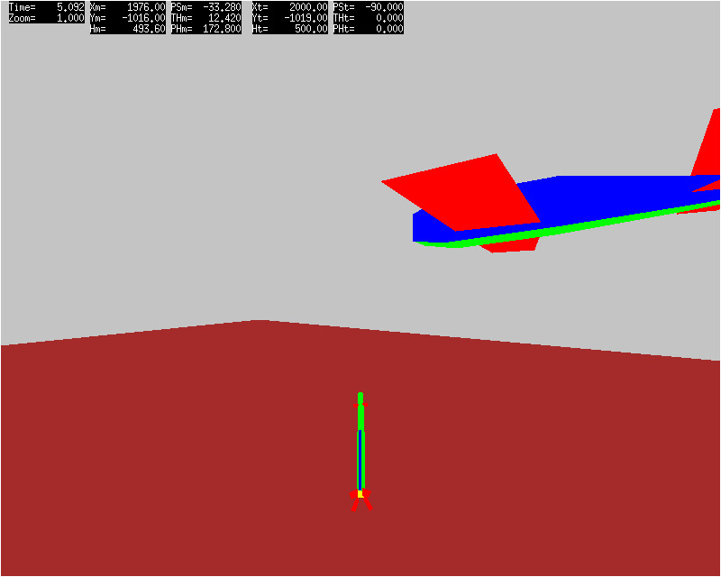

# threeD #

____________

 <p align="center">
  <a href="https://youtu.be/xg66Pwu2sh0" target="_blank">
   </a>
  Frame 240 of img_amim_0000.mp4 (click image for YouTube video)
 </p>

An antiquated C/X11 program which displays animated 3D faceted solid shape rendering of missile/target engagements recorded in trajectory files output from 3-DOF and 6-DOF surface-to-air missile (SAM) flyout simulations. The 3D rendering utilizes a painter's algorithm for hidden surface removal (ref \[1]). The painter's algorithm basically draws polygons from back to front planes of a viewport clipping frustrum, and requires a sorted list of polygons ordered by their centroid distance from the view point. To maintain a dynamic sorted list of polygon centroid distances, a priority queue was selected and implemented as presented in section [2.4](http://algs4.cs.princeton.edu/24pq/) of reference \[[2](http://algs4.cs.princeton.edu/home/)].

## Background ##

The genesis of **threeD** began around 1986 as a Pascal program to perform 3D rendering of solid shapes on an Apple Mac, which only had 2D, 1-bit graphics capability. The progam was developed solely to learn and apply hidden surface removal algorithms before the advent of readily available 3D graphics libraries such as IRIS GL, Direct3D and OpenGL. At that time, most raster graphics hardware could perform 2D polygon drawing and filling, but multi-buffer (vertex, depth, frame, etc.) rendering pipelines were only available on expensive systems with proprietary graphics hardware, drivers and libraries, such as those developed by SGI and Tektronix. Most 3D rendering was performed in software, thus extremely CPU and memory intensive, and very slow; not at all conducive for realtime 3D rendering and animation.

Around the early 1990's, being employed at a weapon systems analysis firm involved in engineering analyses and simulation for SAM early warning and countermeasures projects provided an incentive to convert the Pascal program to FORTRAN and tailor it to process flight path and trajectory output files from several air combat and 3-DOF/6-DOF missile flyout simulations. It was primarily used as a post-processimg visualization tool to assist in simulation enhancement and V&V activities, and to generate presentation material illustrating areas of interest and concern. During this period the program evolved into several variants for different computing systems and graphics libraries.

By late 1990s and early 2000s, having resigned from the weapon systems analysis firm, continued work with the program languished and it became a novelty item to install on various personal Linux and Windows/Cygwin systems to evaluate X11 features, capabilites and resolve compatiblity issues. Recently it resurfaced as a simple C/X11 program to evaluate X11 capability on Window 10 WSL2 with Ubuntu 20.04 distribution. What is documented herein is the result of this effort.

## Repository Structure ##

The repository main directory contains this README file, plain text disclaimer file and the following script files:

+ **Exec_threeD** - Bash script to execute ./bin/threeD.exe for specified TXYZ.OUT case number
+ **Make_threeD** - Bash script to invoke GNU make with Makefile appropriate for identified system
+ **Makefile_Linux** - Makefile used by GNU make to build **threeD** excutable on Linux system
+ **Makefile_Cygwin** - Makefile used by GNU make to build **threeD** excutable on Cygwin system
+ **txyz_symlink** - VS Code debugging preLaunch script to create TXYZ.OUT symbolic link

The contents of each subdirectory are as follows:

+ .vscode - MS Visual Studio Code workspace task and launch settings JSON files.
+ bin - **threeD** program executable **(Exists only in local repository workspace)**
+ dat - Facet model polygon data files for missile, target, ground grid and plane.  
+ doc - Usage and informational documentation (e.g., [Discord_Post_1](./doc/Discord_post_1.md))
+ src - C source code files comprising the **threeD** program
+ txyz - TXZY.OUT trajectory data files for sample missile/target engagement cases
+ util - Bash scripts to merge captured image sequences into animated GIF or MP4 video files
+ Ximg - Images captured during **threeD** execution **(Exists only in local repository workspace)**

The provided shell scripts enable a user to build and execute **threeD** entirely independent of MS Visual Studio Code IDE. However, the .vscode subdirectory contains build task and debug launch settings JSON files for those inclined to work with **threeD** using MS VS Code. This must be done with VS Code running a WSL2 installed Linux distribution, and with appropriate C/C++ extensions for editing, analyzing, compiling and debugging C code.

## Execution Prerequisites ##

Latest development effort for the **threeD** program has been on a bootable Ubuntu 18.04 Linux system and on a Windows 10 Pro system with WSL2 running an Ubuntu 20.04 Linux distribution. Although **threeD** had been successfully built and executed with Cygwin on Windows 2000, XP and 7 systems, no work has been done recently to ensure the provided Makefile_Cygwin file will create a **threeD** executable. In addition to GNU make and gcc toolchains, the following libraries and applications are required to build and execute **threeD**, and work with captured pixel image files.

+ libX11-dev for X11 client-side library libX11 and include headers
+ libxt-dev for X11 toolkit intrinsics libXt and include headers
+ libxpm-dev for X11 pixmap libXpm and include headers
+ libmotif-dev for Motif libXm and include headers
+ ImageMagick for convert app to convert XPM to GIF/JPEG formats and create animated GIF
+ ffmpeg to create MP4 video file from JPEG image sequence
+ ffplay or other video player such as MS Windows Media Player or VLC media player.

The **threeD** program is an X11 application that opens a desktop window in which animated 3D rendering is displayed. On Linux and Windows systems, a running X server is required. Most Linux distributions provide and start X server prior to displaying the desktop graphical interface. On Windows a third party X server application, such as VcXsrv, must be installed and activated before **threeD** can run. The following web articles provide information to get VcXsrv installed and working with a Windows 10 WSL2 Linux distribution.

+ [WSL2 GUI X-Server Using VcXsrv](https://www.shogan.co.uk/how-tos/wsl2-gui-x-server-using-vcxsrv/)
+ [X11 - Guide to WSL](https://www.guide2wsl.com/x11/)

If needing to use ssh or rdp to connect to a running WSL Linux instance, the following /etc/wsl.conf file on the installed Linux distribution is convient.

```
[boot]
#systemd=true
command="service dbus start; service ssh start; service xrdp start"
```

## Execution Overview ##

The following steps delineate typical **threeD** utilization from within a bash shell terminal.

### 1. Build threeD executable ###
From within the ./threeD directory, invoke **./Make_threeD** to build "./bin/threeD.exe".

This step only needs to be performed when the **threeD** repository is first installed, and after any code changes have been made to **threeD** source files.

### 2. Render animation and capture image sequence ###
From within the ./threeD directory, invoke **./Exec_threeD** with a specified TXYZ.OUT case number (i.e.,  0000, 0001, 0002 or 0003).

A blank threeD display window should appear on the desktop and keypress options to control the animation printed in the terminal window. Animation starts by clicking a mouse button when the mouse cursor is placed within the threeD display window. Keypresses are only effective if the mouse cursor is within the display window. Pressing the "Esc" key or closing the threeD display window will terminate the program.

### 3. Create animated GIF or MP4 video ###
Upon termination of the **threeD** program, change to the ./Ximg subdirectory and invoke **../util/xpm2gif** to create animated GIF file named "img_anim.gif", or invoke **../util/xpm2mp4** to create MP4 video file named "img_anim.mp4".

Note, to prevent captured and converted images from a previous **threeD** execution being incorporated into a subsequent animated GIF or MP4 video file, it's recommended all img_####.\[xpm|gif|jpg] files be deleted from the ./Ximg subdirectory before beginning another **threeD** execution. Also, rename or move the newly created animated GIF or MP4 video file to prevent it being overwritten. 

## Caveats ##

All input facet model shape polygon data file paths are hard coded in the draw3D.c file. This was done to shift the task of assigning file paths to OS shell scripts external to **threeD** for batch processing management. Although the program is now interactive, batch processing use cases were not human-in-the-loop.

Quadrilateral polygons are used as shape facets, instead of triangles in modern surface mesh models, since it was easier and faster to decompose missile and target shapes into quad patches. Also, there was no requirement to calculate accurate surface normals to model realistic lighting effects. Each facet is assigned a constant fill color.

There is no attempt to resolve problems rendering intersecting polygons. Other than time of intercept, as missile impacts target, adjoined polygons do not intersect others.

The provided TXYZ.OUT.#### trajectory files generated by a 3-DOF MathCad model of an ideal proportional-navigation guided missile correspond to the following engagement scenarios for a typical MANPADS type SAM.

+ 0000 - Fixed-wing target at constant speed, altitude and heading; SAM launched with 12 degree elevation and 10 degree lead azimuth.
+ 0001 - Fixed-wing target performing a constant 1g banking level turn toward its left; SAM launched with 12 degree elevation and 10 degree lead azimuth.
+ 0002 - Fixed-wing target performing a constant 1g banking descending turn toward its left; SAM launched with 12.6 degree elevation and 27 degree lead azimuth.
+ 0003 - Fixed-wing target performing a constant 3g banking descending turn toward its left; SAM launched with 14 degree elevation and 27 degree lead azimuth.

In each case the SAM was launched against a target initially at 2000 meters downrange, 500 meters height above ground level, and heading 90 degrees left of the missile launch location.

## References ##

\[1] David F. Rogers,"Procedural Elements for Computer Graphics" McGraw-Hill, Inc., 1985.

\[2] Robert Sedgewick and Keven Wayne, "Algorithms, 4th edition", Addison Wesley Professional, March 23, 2011. [Web available at algs4.cs.princeton.edu](http://algs4.cs.princeton.edu/home/)

## Disclaimers ##

+ See the file [DISCLAIMER-GED](./DISCLAIMER-GED)

## Epilogue ##

Over its life span the **threeD** program has retained a monolithic structure, relying on global file scope variables to minimize effort required to refactor into different code languages or tailor to host computer OS toolchains and execution processes. In the present day, with standardization and ubiquity of code development environments among MS Windows and Linux OS systems, this C code variant could surely be refactored as an implementation of C++ object oriented design patterns without detrimentally affecting OS compatibility. The verbose semantics could also be relaxed, replacing explicit vector and matrix math operations with calls to efficient library functions for example, allowing modern compilers to perform optimizations that were non-existant some 30+ years ago when **threeD** was first coded as a Pascal program on an Apple Mac.

For those of us old enough to stroll down X11 memories lane, or young enough to enjoy tales of ancient X11 code, may I suggest the following link.

+ [Cool, but obscure X11 tools](https://cyber.dabamos.de/unix/x11/)
